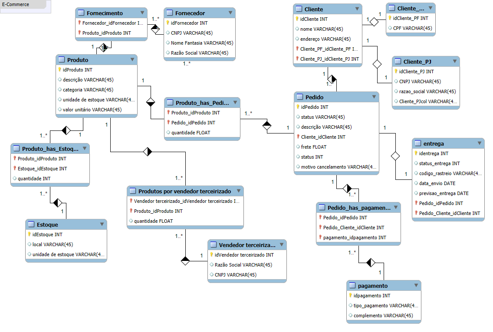

# 🛒 Projeto de Banco de Dados - E-commerce

Este projeto é parte de um desafio de modelagem de banco de dados para um sistema de e-commerce. O objetivo é representar as entidades e relacionamentos fundamentais que compõem o funcionamento de uma loja virtual, com destaque para clientes, produtos, pedidos, pagamentos e entregas.

## 📌 Objetivo

Desenvolver um **modelo conceitual** robusto para um sistema de e-commerce, atendendo aos seguintes critérios:

- Representar clientes como **Pessoa Física (PF)** ou **Pessoa Jurídica (PJ)**, mas nunca ambos.
- Permitir múltiplas **formas de pagamento** por pedido.
- Incluir informações detalhadas de **entrega**, como status e código de rastreio.
- Relacionar produtos com fornecedores, estoques e vendedores terceirizados.
- Permitir controle preciso da quantidade de produtos por pedido, estoque e fornecedor.

## 🧱 Modelo Conceitual

### Entidades Principais:

- **Cliente:** Pode ser PF ou PJ (relacionamento 1:1 exclusivo).
- **Produto:** Informações gerais como descrição, categoria, valor unitário, etc.
- **Pedido:** Inclui status, descrição, cliente associado e frete.
- **Pagamento:** Permite múltiplas formas de pagamento por pedido.
- **Entrega:** Contém status da entrega, código de rastreio e datas.
- **Estoque:** Local físico e unidade de controle.
- **Fornecedor:** Empresa que fornece o produto.
- **Vendedor Terceirizado:** Representa produtos vendidos por terceiros.

### Relacionamentos:

- Um **cliente** tem **vários pedidos**.
- Um **pedido** pode conter **vários produtos** (com quantidade).
- Um **pedido** pode ter **várias formas de pagamento**.
- Um **pedido** possui **uma entrega**.
- Um **produto** pode estar em **diversos estoques**.
- Um **produto** pode ser fornecido por **vários fornecedores**.
- Um **produto** pode ser vendido por **vários vendedores terceirizados**.

## 🔗 Regras de Negócio Implementadas

- Cada **cliente** é **exclusivamente PF ou PJ**.
- O relacionamento `Produto_has_Pedido` armazena a **quantidade** vendida por item.
- A tabela `Pedido_has_pagamento` permite **vários métodos de pagamento** por pedido.
- A tabela `entrega` contém os campos:
  - `status_entrega`
  - `codigo_rastreio`
  - `data_envio`
  - `previsao_entrega`
- A relação `Produto_has_Estoque` registra a **quantidade disponível por estoque**.

## 🖼️ Diagrama ER

O diagrama completo está disponível na imagem `ecommerce.png` neste repositório.



---

## 🗂️ Estrutura de Arquivos

```bash
📁 ecommerce-db/
├── ecommerce.png               # Diagrama Entidade-Relacionamento
├── README.md                   # Documentação do projeto
